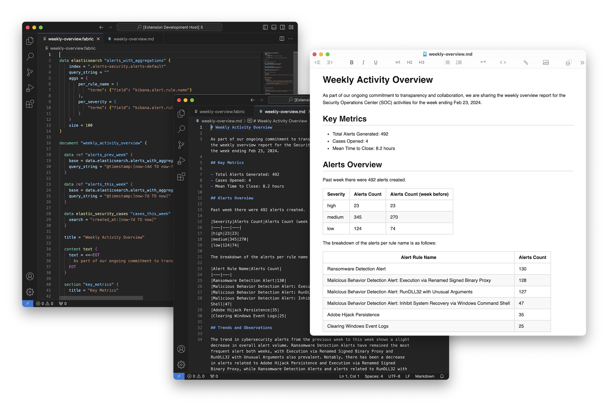

<div align="center">

<!-- Update logo path if necessary -->

<br/>
<br/>

[Releases](https://github.com/blackstork-io/blackstork-cli/releases) | [Docs](https://blackstork.io/docs/) | [Slack](https://blackstork-community.slack.com/)


[](https://blackstork-community.slack.com/)

</div>

**`blackstork-cli`** is a source-available, headless execution engine for BlackStork templates. It automates cybersecurity and compliance reporting by extracting structured data from external tools, evaluating template logic, and rendering formatted documents.

<div align="center">
    
</div>

The engine parses templates written in the BlackStork configuration language (`.blackstork.hcl`). By explicitly separating data queries, content drafting, formatting, and publishing into distinct modular blocks, engineers can version-control their reporting workflows and execute them locally or within CI/CD pipelines.

See the [Documentation](https://blackstork.io/docs/) for a complete syntax reference and the [Tutorial](https://blackstork.io/docs/tutorial/) to build your first template.

> [!NOTE]
> `blackstork-cli` is under active development. If you encounter bugs, require a specific plugin, or have feature requests, please open an issue or join the [BlackStork Community Slack](https://blackstork-community.slack.com/).

## Plugins

The CLI engine utilizes plugins to connect with external APIs and services. The official registry includes integrations for SIEMs ([Elastic](https://blackstork.io/docs/plugins/elastic/), [Splunk](https://blackstork.io/docs/plugins/splunk/), [Microsoft](https://blackstork.io/docs/plugins/microsoft/)), Threat Intelligence platforms ([OpenCTI](https://blackstork.io/docs/plugins/opencti/), [VirusTotal](https://blackstork.io/docs/plugins/virustotal/)), standard databases, and LLM providers ([OpenAI](https://blackstork.io/docs/plugins/openai/)). 

For a complete list of supported integrations, see the [Plugins Documentation](https://blackstork.io/docs/plugins/).

## Community Templates

A library of production-ready templates for SOC summaries, incident response, pentesting, and compliance frameworks is available in the [BlackStork Templates](https://github.com/blackstork-io/blackstork-templates) repository.

## Installation

### Homebrew (macOS)

Install `blackstork-cli` using the official tap, which updates automatically with every release:

```bash
# Install the CLI from the tap
brew install blackstork-io/tools/blackstork-cli

# Verify the installation
blackstork-cli --version
```

### GitHub Releases

Pre-compiled binaries for Linux, macOS, and Windows are available on the [Releases](https://github.com/blackstork-io/blackstork-cli/releases) page.

Example installation for macOS (arm64):

```bash
# Create a destination directory
mkdir blackstork-bin

# Download the latest release
wget https://github.com/blackstork-io/blackstork-cli/releases/latest/download/blackstork-cli_darwin_arm64.tar.gz -O ./blackstork-cli_darwin_arm64.tar.gz

# Extract the archive
tar -xvzf ./blackstork-cli_darwin_arm64.tar.gz -C ./blackstork-bin

# Verify execution
./blackstork-bin/blackstork-cli --help
```

## Usage

The `blackstork-cli` binary provides three primary commands:

- `install` - Resolves and downloads all required plugin dependencies defined in the global configuration block.
- `data` - Executes a specific data query block and outputs the resulting structured JSON to standard output. Useful for testing API integrations.
- `render` - Evaluates a target document block and outputs the rendered text (Markdown by default) to standard output, or delivers it via publishers if the `--publish` flag is provided.

```text
$ blackstork-cli --help
Usage:
  blackstork-cli [command]

Available Commands:
  completion  Generate the autocompletion script for the specified shell
  data        Execute a single data block
  help        Help about any command
  install     Install plugins
  render      Render the document

Flags:
      --color               enables colorizing the logs and diagnostics (if supported by the terminal and log format) (default true)
  -h, --help                help for blackstork-cli
      --log-format string   format of the logs (plain or json) (default "plain")
      --log-level string    logging level ('debug', 'info', 'warn', 'error') (default "info")
      --source-dir string   a path to a directory with *.blackstork.hcl files (default ".")
  -v, --verbose             a shortcut to --log-level debug
      --version             version for blackstork-cli

Use "blackstork-cli [command] --help" for more information about a command.
```

## Security

If you discover a potential vulnerability in `blackstork-cli` or its official plugins, please report
it via GitHub's [security advisory reporting mechanism](https://github.com/blackstork-io/blackstork-cli/security/advisories/new). 

We request that you adhere to coordinated disclosure practices. Do not publicly disclose
vulnerabilities until we have investigated the report, prepared a patch, and provided users
sufficient time to upgrade.

## License

`blackstork-cli` is source-available and licensed under the **Business Source License (BUSL) 1.1**.

You are free to download, modify, and run the engine locally or in your internal CI/CD pipelines to
generate reports for your own organization. You are strictly prohibited from offering
`blackstork-cli` as a hosted or managed service to third parties, or embedding it into a competing
commercial software product.

For hosted reporting, collaborative editing, and stakeholder analytics, see the commercial
[BlackStork SaaS platform](https://blackstork.io).

See the [LICENSE](LICENSE) file for complete details.
