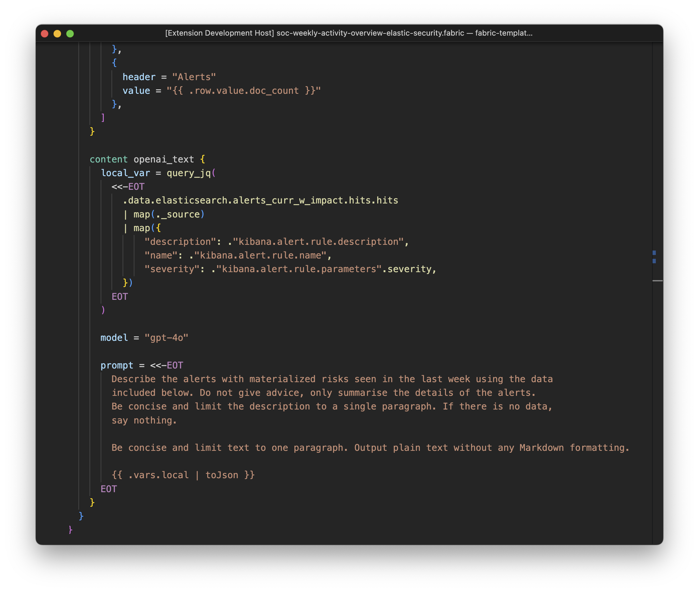
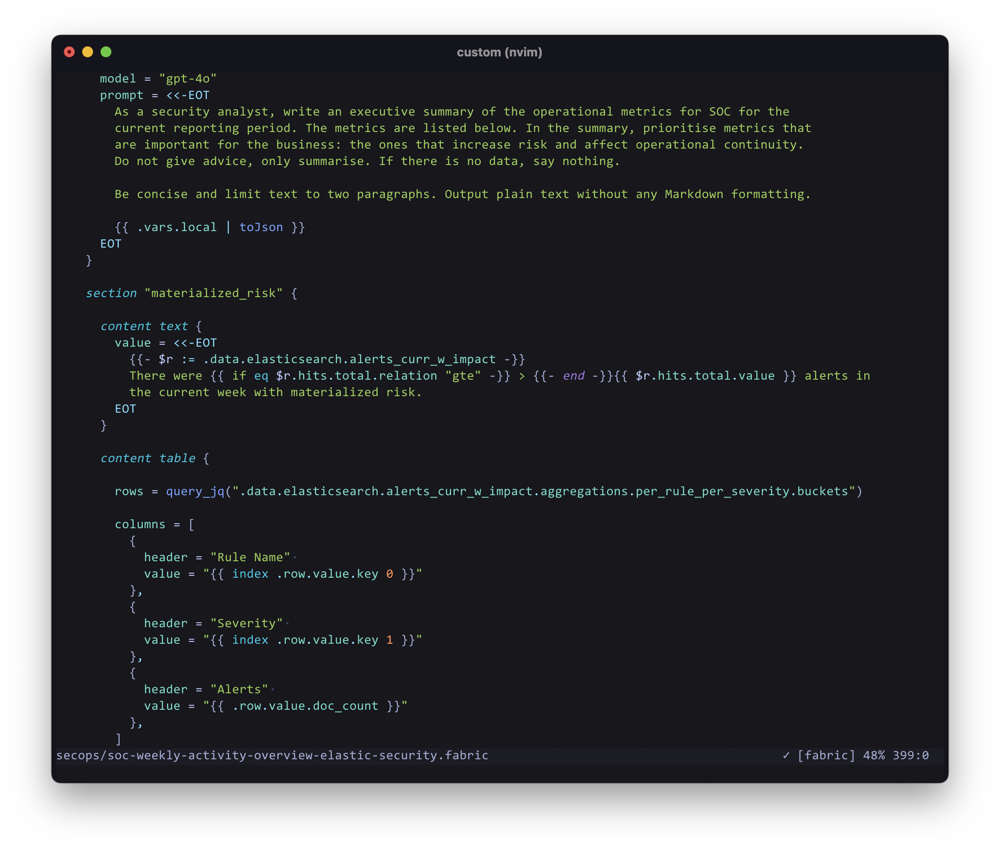

# BlackStork configuration language

The BlackStork configuration language provides the declarative syntax used to build document templates. It allows you to express data requirements, configurations, and document layout directly in code.

Templates act as execution blueprints. When evaluated, the BlackStork engine parses these files to determine which external systems to query, how to process the returned data, and how to structure the final rendered document.

BlackStork configuration files use the `.blackstork.hcl` extension. A project can consist of a single file or a directory containing multiple configuration files.

## Core concepts

The BlackStork language is built on top of the [HashiCorp Configuration Language](https://github.com/hashicorp/hcl) (HCL). If you have used tools like Terraform, the syntax will be immediately familiar. 

Configurations are built using two fundamental elements:

- **Blocks**: containers that define objects, such as global configurations, data requiremenets, or content structures. Blocks always include a block type and may have zero or one label (name).
- **Arguments**: key-value pairs defined within blocks that assign specific values to block's attributes.


```hcl
# Structure of a named data block:

<BLOCK-TYPE> <PLUGIN> "<BLOCK-NAME>" {
    <ARGUMENT> = <VALUE>
}

# Example of a named data block :

data elasticsearch "alerts" {
    index = ".alerts-security.alerts-*"
    query_string = "kibana.alert.severity:critical"
}

# Structure of an anonymous data source configuration block:

<CONFIG> <BLOCK-TYPE> <DATA-SOURCE> {
    <ARGUMENT> = <VALUE>
}

# Example of an anonymous data source configuration block:

config data elasticsearch {
    cloud_id = "my-elastic-cloud-id"
    api_key  = "my-elastic-cloud-api-key"
}
```


See [Syntax](./syntax/) for detailed rules on writing BlackStork configurations.

## IDE support

Because BlackStork files use the `.hcl` extension, basic syntax highlighting will work automatically in almost all modern IDEs if you have standard HashiCorp/Terraform plugins installed.

However, because BlackStork templates heavily utilize embedded JQ queries and Go templates, we maintain dedicated editor extensions to provide advanced syntax highlighting for these embedded languages.

### Visual Studio Code

We maintain the [vscode-blackstork](https://github.com/blackstork-io/vscode-blackstork) extension for VS Code. This extension provides native HCL syntax support combined with strict highlighting for embedded JQ strings and Go templates, making complex document structures easier to read.



Installation instructions are available in the extension's [README](https://github.com/blackstork-io/vscode-blackstork).

### Neovim

For Neovim users, we maintain [blackstork.nvim](https://github.com/blackstork-io/blackstork.nvim). The plugin uses a BlackStork-specific [tree-sitter dialect](https://github.com/blackstork-io/tree-sitter-blackstork) extending the standard [tree-sitter-hcl](https://github.com/tree-sitter-grammars/tree-sitter-hcl) parser.

It brings accurate code highlighting to embedded JQ queries and Go template blocks within your `.blackstork.hcl` files.



Installation instructions are available in the plugin's [README](https://github.com/blackstork-io/blackstork.nvim).


## Next steps

See [Syntax]() to learn the core syntax components of the language.
